# Example Questions for the  Neuroprosthetics Exam

## 1. What types of neural implants do you know? Which groups can they be classified into?

There are the following groups of neuroprostheses:
- __Neuromodulation__: these prostheses stimulate some neuron directly in the nervous system, but do not have additional replace cells or organgs like sensory cells or motor cells. For example pacemakers, deep brain stimulation for _Parkinson_ or _epilepsie_ control belong to this group. Additionally, they are used to inhibit firing of pain information to the brain for active pain control.
- __Functional electric stimulation__: Stimulation of cells that are normally stimulated by the brain. E.g. stimulation of muscle cells.
- __Transcranical Magnetic Stimulation__: Stimulation using magnetism. Use for example for patients suffering from stroke and for research purposes.
- __Motorprostheses__: replace a mechanical structure and the actuation of the latter by an artifical system. Potentially, the actuations of the prosthesis is controller by a neural interface to still remaining efferent nerve fibres. For example a replace leg or knee combined with artificial actuation of the joints is a motorprosthesis.
- __Sensory Neuroprosthesis__: Sensory neuroprostheses replace sensory cells and stimulate the remaining (and still functional) nerve fibres accordingly. This prostheses are used if the nerve fibres are still intact but the functionality of the sensory cells is gone. For example cochlear and retina implants belong to this group.
- __Bidirectional Neuroprostheses__: Combine a motorprosthesis with sensory feedback. For example a motorprostheses of a leg with tactile sensor that feed back tactile information to nerve fibres are bidirectional.
- __Brain Computure Interface__: Signals on nerve fibres are used to control a computer.
- __Brain-Brain Interface__: These prostheses allow to build a artifical bridge between different parts of the brain. Research on how to use if for dementia therapy.

## 2. Explain the concept of stability in a numerical solver for differential equations.

Numerical solvers are algorithms that can be applied to approximately solve differential equations. More precisely, they allow to approximately obtain a trajectory given the differential equation and initial conditions. As numerical solvers are implemented algorithmically, they inherently perform time-discretization. A numerical solve is called __stable__ if it creates a stable trajectory if the true solution of the differential equation is also stable.

A numerical solver is called __stable__ if the error does not grow over the integration steps.

## 3. What are the mechanisms behind the formation of the resting potential of a neuron.

A neuron has a membrane consisting of, among others, sodium channels, potassium channels and a natrium-potassion pump. Additionally, the membrane has some conductivity for ions itself, which is called leakage.
Generally, the membrane seperates two liquids with different ion concentraions. Without any further mechanisms, the movements on the ions is described by __diffusion__ (tendency of an ion to move towards lower concentration) and the __migration__ due to electric forces. Summing up the ion fluxes from diffusion and migration leads to a steady state of the underlying differential equation. In the living cell the ratio of intracellular and extracellular ion concentrations for respective ion is not equal among all ion, which is usually the case for steady states. This is due to the sodium-potassium pump, which continuously moves sodium ion outside of the cell and moves potassium ions back in. Still, the cell maintains a steady state of ion concentrations, which forms the resting potential. As all the differential equations are first-order and there is only a single coupling via the membrane potential, there is no possibility to oscillate and the system converges to the steady state without oscillatory behaviour. This steady state of intra- and extracellular ion concentrations determines the cell resting potential.

## 4. Draw the structure of a typical neuron and label the important parts.

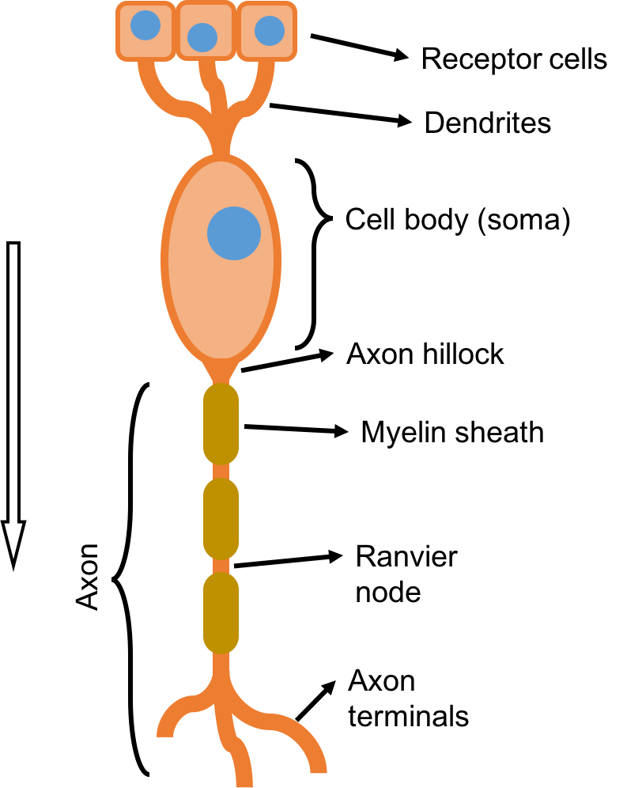

Signal flow starts at the receptor cells at the dendrites. Actions potential then propagate through the dendrites and into the cell body (soma). Afterwards, the action potential propagates through the axon, which is usually the longes part of the neuron. Adding a myelin sheath, the speed of the action potential propagation significantly increases compared to non-myelinisated axons. The myelin sheath decreases the capacity of the membrane and at the same time increases the leakage resistivity. 

## 5. Draw a typical synapse and label the important parts

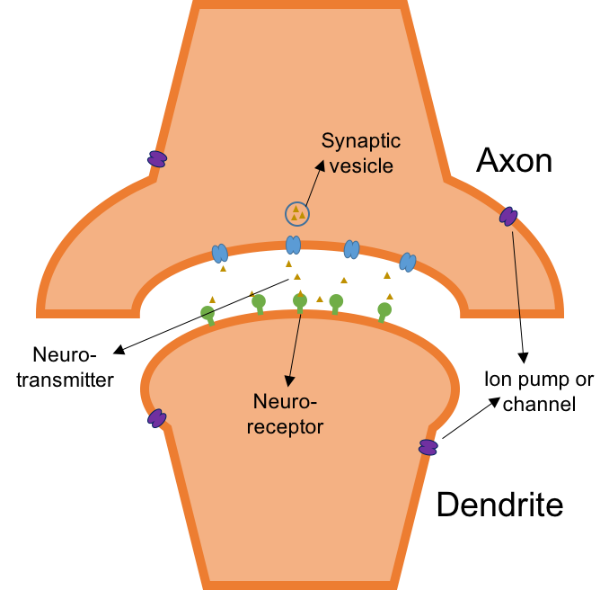

TODO: explain this

## 6. Draw the basic equivalent circuit of a neuron

The cell membrane is modelled as a capacitor as the membrane seperates two charges. The sodium-potassium pump is a current source providing a constant current. As the pump has a 2:3 ratio of potassium and sodium ions, respectively, there is actually charge flowing. The sodium and potassium channels are modelled as batteries and resistors. There are sodium and potassium channel. As these ions flow in different directions, the batteries are reversely placed. The voltages of the batteries are set to the Nernst potentials of the respective ions. Additionally, the ion leakage is modelled comparable to the channel model consisting of a battery and a resistor.

## 7. Derive the differential equation that describes the electric potential of a neuron

The differential equation describing the electric potential across the membrane is derived based on the equivalent circuit shown above.
The membrane potential is the difference of the extracellular and intracellular potential. In the equivalent circuit this voltage is present at the connectors of the membrane capacity $C_m$. The general equation for a capacitor is
$$i = \frac{dV}{dt}C_m ,$$
where the sum current $i$ is the sum of all the currents depicted in the drawing of the equivalent circuit
$$i = i_{pump} + i_{K} + i_{Na} + i_{L} .$$
For the serial interconnection of the batteries and the resitors we use
$$i_k = g_k (V_m - E_k) \text{ for } k \in \{K, Na, L\} .$$
Adding these facts we get the differential equation describing the membrane potential
$$\frac{dV}{dt} = - \frac{1}{C_m}(i_{pump} + g_K(V_m - E_K) + g_{Na}(V_m - E_{Na}) + g_L (V_m - E_L)) .$$

## 8. Explain the switching characteristics of the gating variables (Boltzmannfunction)

The gating variable can either be inactive or active. Given the gating variables, a set of those determines the open/closed state of a sodium or potassium channel, respectively. The open/closed state of the gating variable follows a Boltzmann distribution, where there is a certain propability that a channel transitions from closed to open ($\alpha$) and a propability of the opposite transition ($\beta$). In the gating model of the ion channels, propabilities also depend on the membrane potential $\alpha(V_m)$, $\beta(V_m)$ resulting in a feedback loop.
Potassium channels are conrolled by four activation gates $n$. All four must be open in order to open the corresponding potassium channel. The sodium channels are controlled by three activation gates $m$ and one inactivation gate $h$.

Using the boltzmann equation we get the following differential equations for the gating variables
- $\frac{dm}{dt} = \alpha_m(V_m) (1-m) - \beta_m(V_m) m$
- $\frac{dn}{dt} = \alpha_n(V_m) (1-n) - \beta_n(V_m) n$
- $\frac{dh}{dt} = \alpha_h(V_m) (1-h) - \beta_h(V_m) h$

where, according to Boltzmann, the rates $\alpha$ and $\beta$ are

$$\alpha = A \exp\left(\frac{E_c-E_b}{kT}\right)$$
$$\beta = B \exp\left(\frac{E_o-E_b}{kT}\right)$$

## 9. Please write down the equations that describe the ionic currents in Na$^+$ and K$^+$ channels

The potassium channels are controlled by four activation gates
$$i_{K} = \hat{g}_K n^4 (V_m - E_K)$$
and the sodium channels are controlled by three activation- and one inactivation gate
$$i_{Na} = \hat{g}_{Na} m^3 h (V_m - E_{Na})$$

Where $\hat{g}$ denotes the maximum conductivity when all gates are active.

## 10. Sketch the activation of the gating variables and their time contants in a plot.

- __sodium activation (m)__:
 - steady state value: positive sigmoidal, high slope, at ~$25mV$
 - time constant: very small, small peak at 2nd third of potential axis
- __potassium activation (n)__:
 - steady state value: positive sigmoidal, less slope than m, at ~$10mV$
 - time contant: larger then m, peak at half the potential axis
- __sodium inactivation (h)__:
 - steady state value: negative sigmoid, same slope as m, at ~$10mV$
 - time constant: large peak at $0mV$ generally higher than the other time constants

Let $x$ be a gating variable, we get
$$\frac{dx}{dt} = \alpha (1-x) - \beta x$$
from the Boltzmann equation.
This can be rearranged to
$$\frac{dx}{dt} = (\alpha + \beta) \left(\frac{\alpha}{\alpha+\beta} - m\right) = \frac{1}{\tau}(m_\infty - m).$$

### Steady state values
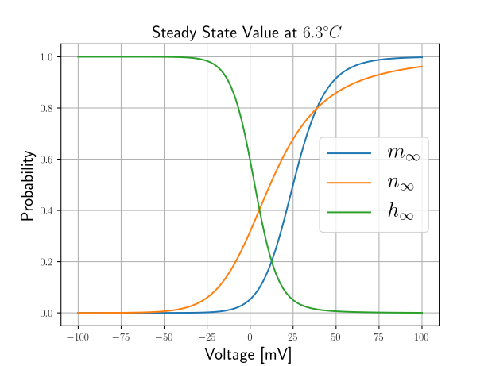

### Time constants
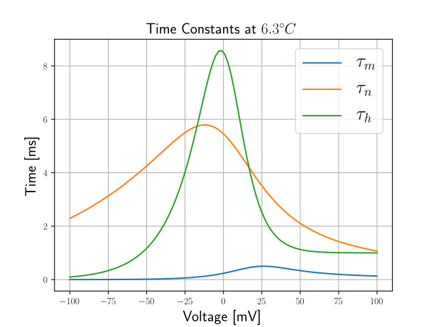

## 11. How does temperature influence the time constants? Write down the equation that describes temperature dependence

Temperature has no effect on the steady state values but changes the time constants of the systems. At higher temperatures the system reacts quicker than at lower temperatures. In order to incorporate temperature, a temperature corrections factor is added to the differential equations for the gating variables
$$ \frac{dx}{dt} = k \alpha (1-x) + k \beta x = k [\alpha (1-x) + \beta x] ,$$
where $k$ is the temperature correction coefficient and often
$$ k = Q_{10}^{\frac{T - T_0}{10}} .$$
Here $T_0$ denotes the temperature of the original temperature where the parameters were fitted and $Q_{10}$ is a value often around $3$.

## 12. Explain how an action potential evolves.
Consider the neuron being stimulated by an external current or the activation function of an external potential field.
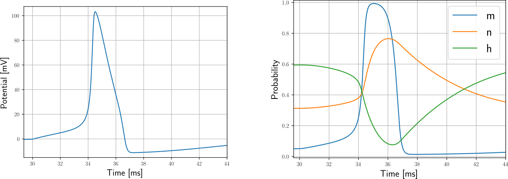
There are the following steps involved to create an action potential
1. The external current charges the membrane capacity and the membrane potential slowly increases.
2. As the membrane potential increases, the sodium and potassium channel open up. Due to the faster time constant of the sodium gates, the sodium channels open first. While still most of the potassium channels are closed and most sodium channels are opened, sodium flows into cell depolarizing it quickly.
3. With increasing membrane potential still increases, the slow inactivation gates start inactivating the sodium channels. At the same time the remaining potassium channels open up. Potassium ion flow outside of the cell, while the sodium ion flux decreases. The cell repolarizes.
4. Due to the time constants of the potassium activation, the channels don't directly close when the resting potential is reached, but the cell is hyperpolarized by potassium ions still running outside of the cell.

## 13. Explain the difference between the absolute and relative refractory period of a neuron

- __absolute refractory period__: time until another action potential can be fired. After an action potential no second action potential can directly be fired as the sodium channels are still inactivated. During the absolute refractory period no action potential can be fired, no matter ho high the stimulation current is.
- __relative refractory period__: during the relative refractory period firing of action potentials is generally possible, but the stimulus required is higher than outside of the refractory period.A

## 14. Draw the basic equivalent circuit of an axon

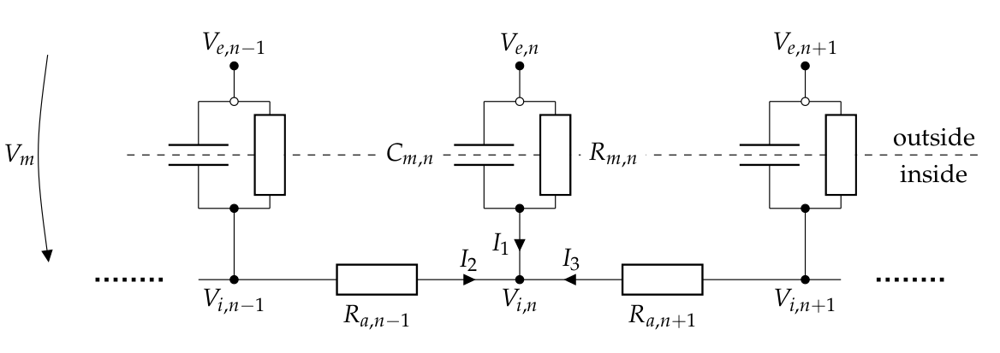

## 15. What are the benefits of myelination?

Myelination means that axon segments are surrounded by Schwann cells. In particular, theses cells add multiple membrane layers around the axon. The befinit is, that the action potential travel much faster through a myelinasated axon compared to a unmyelinasated axon. The myelinasation decreases the membrane capacity and increases the leakage resistivity at the same time. In consequency, action potentially travel through each myelinasated axon segment very quickly. In fact, the potential on both end of the myelinasated segment are approximately the same and the action potential jumps from one end to the other.

## 16. Derive the cable equation for an axon

Using Kirchhoff's law we have
$$I_1 + I_2 + I_3 = 0$$
where $I_1$ is the current through the membrane and compartment $n$ and $I_2$ and $I_3$ are the currents from compartments $n-1$ and $n+1$, respectively.
For the currents we have
$$I_1 = \frac{V_{i,n} - V_{e,n}}{R_{m,n}} + \frac{\partial (V_{i,n} - V_{e,n})}{\partial t} C_{m,n}$$
and
$$I_2 = \frac{V_{i,n} - V_{i,n-1}}{R_a} \text{ and } I_3 = \frac{V_{i,n+1} - V_{i,n}}{R_a}$$
Let the membrane resistance and capacicity be the same for all compartments
$$\forall i\in [1..N]: C_{m,i} = C_m \text{ and } R_{m,i} = R_m .$$
Further, let $V_i = V_m + V_e$ and $V_e = 0$
$$0 = -\frac{V_{m,n}}{R_m} + \frac{dV_{m,n}}{dt} C_m + \frac{V_{m,n} - V_{m,n-1}}{R_a} + \frac{V_{m,n+1} - V_{m,n}}{R_a} ,$$
which can be rearranged to
$$\frac{dV_{m,n}}{dt} = \frac{1}{C_m}\left(-\frac{V_{m,n}}{R_m} + \frac{V_{m,n-1} - 2V_{m,n} + V_{m,n+1}}{R_a}\right) .$$
Let $\vec{V}_m = (V_{m,1} V_{m,2} \ldots V_{m,N})^\top$ be the vector of the membrane potential for each compartment and define
$$ \boldsymbol{C} = \begin{pmatrix}-1&1&0&\ldots&0\\1&-2&1&\ldots&\\0&1&-2&\ddots&\\\vdots&\vdots&\ddots&\ddots&1\\0&&&1&-1\end{pmatrix} .$$
Using these parametrization we get the following relation
$$ \frac{d\vec{V_m}}{dt} = -\frac{1}{C_m} \frac{\vec{V_m}}{R_m} + \frac{1}{C_m R_a} \boldsymbol{C}\vec{V_m} .$$
Expressing the resitances and capacities by length dependent terms yields resistance-densities and capacitance-densities instead of resitances and capacities are measures of resistance and capacity per length-measure, respectively. These density-based measures are denoted with small letters. Taking the limit case of the compartment length towards zero $\Delta l \rightarrow 0$ and introducing a time and place dependent membrane potential ($V_m(t, x)$) instead of the vectorized place-discrete formulation yields
$$\frac{\partial V_m}{\partial t} = -\frac{1}{c_m r_m}V_m + \frac{1}{c_m r_a}\frac{\partial^2 V_m}{\partial x^2}.$$
Let $\tau = c_m r_a$ and $\lambda = \sqrt{\frac{r_m}{r_a}}$, we get the cable equation
$$\tau \frac{\partial V_m}{\partial t} + V_m = \lambda^2 \frac{\partial^2 V_m}{\partial x^2}.$$

## 17. What is the activation function?

The activation function is the second spatial derivative of the external potential.
$$\text{activation} = \frac{\partial^2 V_e}{\partial x^2}$$
when $x$ denotes the coordinate axis along the axon. The activation function tells how an axon is stimulated using an external potential.

## 18. Explain the terms "rheobase" and "chronaxie"

### Rheobase current
When stimulating a neuron, such that it elicits an action potential, the stimulation current must be above some specific threshold. If the current is below that threshold, the system settles down on a stable equilibrium without and action potential being fired. More precisely, the membrane potential is increases, but stays constant below the firing threshold during the stimulation. The __rheobase__ current is the current for which the time to spike is infinitive but the spike will still happen after infinite time in theory. That means, only slightly increasing the rheobase current in the positive direction will elicit an action potential after finite time. Applying the rheobase current as stimulus will let the neuron settle down on the threshold potential.

### Chronaxie time
Consider a neuron stimulated with twice the rheobase current. The neuron will elicit an action potential after the __chronaxie__ time.

## 19. How is sound pressure and -intensity defined?

Sound travels as longitudinal wave through a medium, e.g. air. The sound pressure $p$ is the amplitude of the pressure oscillation in the air. It is measured in Pascal (usually $\mu \text{Pa}$) as the amplitudes are quite small.
$$[p] = 1\text{Pa}$$

Sound intensity $I$ is a power per area and is the product of sound pressure and particle velocity
$$I = pv \text{ where } [I] = 1\frac{W}{m^2}$$

## 20. How is sound pressure level defined?
The sound pressure level $SPL$ is the sound pressure on a logarithmic scale with respect to a reference pressure $p_0$. The sound pressure level is measure in decibel $[L] = 1dB$

$$ L = 20 \log_{10}\left(\frac{p}{p_0}\right).$$
Usually the reference pressure is at $p_0 = 20\mu\text{Pa}$.

## 21. Draw the human hearing range in a plot (SPL vs. frequency) and name the limits

- Highest sensitivity: between $2$ and $5 k\text{Hz}$
- speech: 100Hz - 5kHz, 40-80dB
- music: 50Hz - 10kHz, 20-90dB
- pain limit: 135dB little shrinking for high frequency, starting at 2kHz, goes down to 120dB

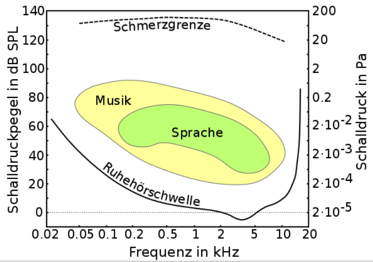

## 22. Explain the structure of the peripheral hearing organ (outer and middle ear)

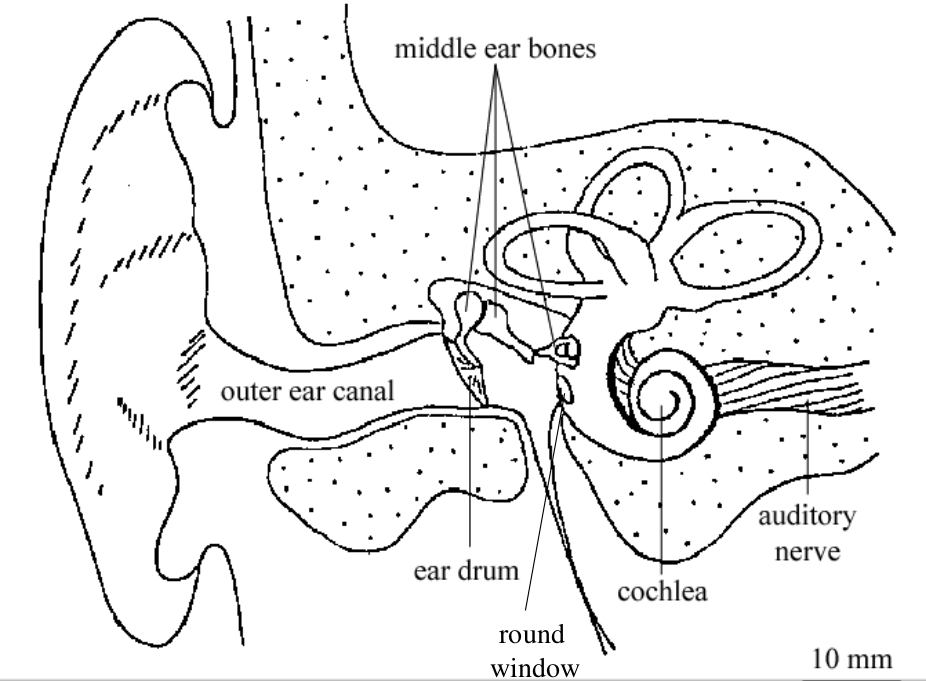

The ear canal connects the middle ear with the outer ear. At the end of the ear canal, the ear drum is located. This membrane is stimulated by the sound pressure changes and oscilliates. Here, a transducion from sound energy to mechanical energy happens. Through the ear bones (malleus, incus and stapes) the osciallation are transferred and enter the cochlear through the oval window.

## 23. Explain the structure of the Cochlear (inner ear)

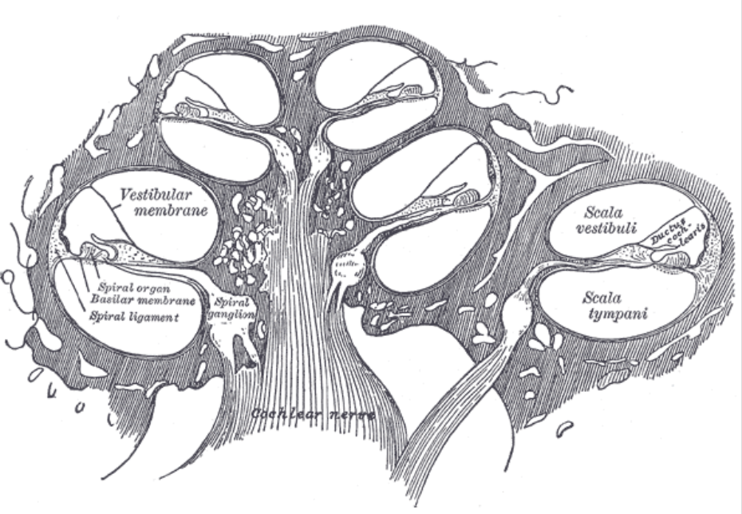

The cochlear is snail shaped. Inside this spiral structure there are three chambers seperated by membranes. There is the _scala vestibuli_, _scala tympani_ and _scala media_. The membrane between scala tympani and scala media is called basilar membrane. On the latter membrane the organ of Corti is located. The chamers in the spiral are fluid filled. Oscillations enter the fluid through the oval and circular window, respectively.

## 24. Explain the structure of the organ of Corti including the nerve fibres.

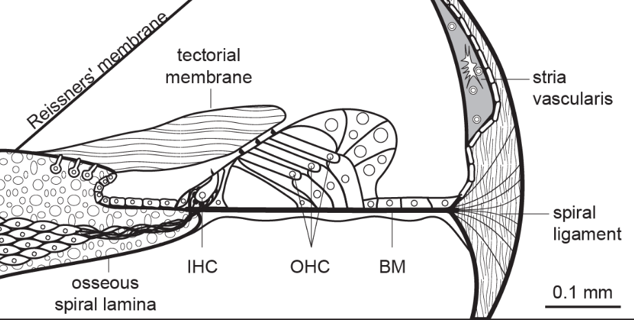

The organ of Corti is located on the basilar membrane. The image above shows a cut of the cochlear with the organ of Corti visible. There are three outer haircells and one inner hair cell visible. The stereocilia of the hair cell tough the tectorial membrane and oscillation of the basilarmembrane lets the stereocilia move and open potassium channels at the same time. As most of the hearing happens through the inner hair cells, most of the afferent nerve fibres are connected to the inner hair cells. The outer hair cells more work as an active oscillation amplifier. The outer hair cells move by electromotility, that is, change of the membrane potential of the outer hair cells lets them shrink and stretch very quickly. As the membrane potential is influenced by the outer hair cell's stereocilia, there is positive feedback amplifying the oscillations.

## 25. Explain the mechanism of frequency-place transformation
The basilar membrane is a long membrane structure with different stiffness and mass parameters along the membrane. Incoming sound propagrates as a traveling wave through the basilar membrane. At each point of the membrane, the mechanic properties give rise to a specific resonance frequency. As the wave travels through the basilar membrane, the oscillation is highest where the resonance frequency of the membrane matches the stimulating frequency. In summary, for different sound frequencies the peak of the oscillations is highest at a specific place of the basilar membrane where the resonance frequency matches the stimulating frequency. Which is called the frequency-place transformation.

## 26. What is the difference between inner and outer hair cells?
__Inner hair cells__ are the actual hearing sensors. As the IHC's stereocilia move, IHC get excited and stimulate the many connected afferent nerve fibres. On the other hand the __outer hair cells__ work as active oscillation amplifiers. By electomotility, the OHC's shrink and stretch based on the membrane potential. In contrast muscle cells, the OHC can move much quicker and can directly oscillate at audio frequency. The stereocilia of the OHC's are stimulated by the vibration of the basilar membrane, which influences the membrane potential. This closes the loop and the OHC give positive feedback to the oscilliation amplyfying it.

## 27. Describe and sketch the mechanical excitation of the basilar membrane for stimuli with different frequency and amplitude.
Waves travel through the basilar membrane. For low frequencies the amplitude of the basilar membrane oscillations is highest at the more apical positions, while high frequencies give rise to high oscillations at the more basal parts of the basilar membrane.

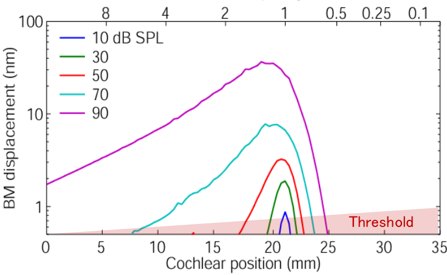

## 28. What is the rate-place principle? What is tonotopy?

__rate-place principle__: specific nerve fibres are more sensitive to special frequencies dependent on the location of the conneced hair cell in the cochlear. Consider a constant-frequency tone stimulating the basilar membrane. Nerve fibres connected to hair cells at specific locations in the cochlear will show different firing rates.

__tonotopy__: Close to the windows the membrane is stiffer than in the more apical parts of the membrane. That's why, the more basal parts respond to higher frequencies and the more apical respond more to the lower frequencies.

## 29. What happens during phase locking? Explain the volley principle
For lower frequencies the firing of action potentials is phase-locked to the audio signal. That means, that action potentials are more likely fired at specific phases of the audio signal. Using this principle, the human hearing does not only have frequency information, but also phase information of the audio signal. However, this is only true for lower frequencies as the nerve fibres have to chance to synchronize the rate of action potential to the audio signal for higher frequencies. At higher frequencies, the action potential occur at any phase of the high-frequency signal.
The maximum rate of action potentials per nerve fibre is limited. The __volley principle__ states that only a subset of the nerve fibres fire per phase, but as there are many fibres, the phase information is still available by looking at all the nerve fibres.

## 30. Explain how the large dynamic range is coded in the auditory nerve

The mechanical properties of the basilar membrane perform dynamic compression. A wide dynamic range $30dB$ to $120dB$ is mapped to a narrow range of basilar membrane displacement on a range of not more than two ten-based logarithmic scales.

## 31. On which principles is the coding based? (Compression, HSR, MSR, LSR, Recruitment)

### HSR, MSR, LSR
There are different types of nerve fibres that can be classified into __high__, __medium__ and __low spontaneous rate__ fibres. High spontaneous rate fibres are very sensitive and even fire action potentials out of spontaneity. Medium spontaneous rate fibres do not as often fire spontaneous action potentials but are also less sensitive to stimulation by the hair cells. LSR nerve fibres are the most sluggish version, that nearly show no spontaneous action potentials and need comparatively high stimulation in order to fire an action potential.
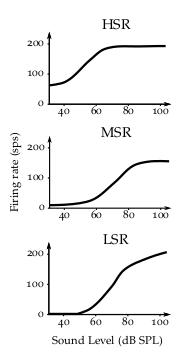

### Compression
a wide dynamic range of sound pressure is encoded by a comparatively narrow range of basilar membrane displacement
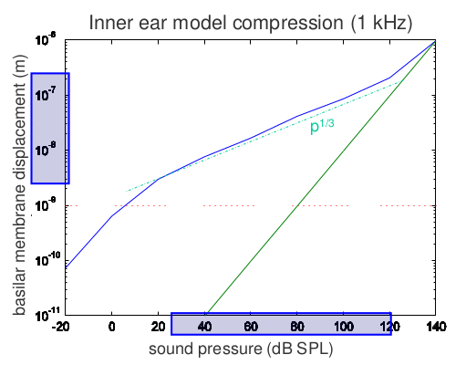

### Recruitment
Low amplitude signal only stimulate a narrow range of the basilar membrane. Higher amplitudes let a broader, asymmetric part of the basilarmembrane oscillate.

## 32. How can the ability to hear be diagnosed objectively?
Using __otoacoustic emissions__. The outer hair cells produce a very low amplitude sound. Only about 50% of the humand have sponteneous emissions. On the other hand, every human has stimulated otoacoustic emissions, that are the response to a sound stimulus. In a sound-proof chamber, stimulated otoacoustic emissions can be captured by a highly sensitive microphone. This is used as an early diagnostic tool on newborns. Otoacoustic emissions are also present when the aoustic perception is the brain was not yet fully developed.

## 33. Draw a signal flow diagram of a cochlear implant. Explain the purpose of the different components.

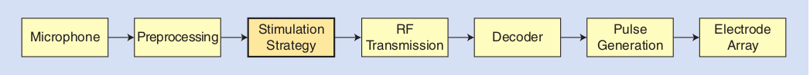

- __microphone__: the microphone captures the sound
- __preprocessing__: perform automatic gain control, anti-aliasing, pre-emphase
- __stimulation strategy__: the basic stimulation strategy of the nerves in the cochlear, here are different strategies available.
- __RF transmission__: the cochlear implant is divided into two parts. There is one implanted part in the head and an external signal-procssing and power device. The two parts communicate via an inductive link on radio frequency.
- __decoder__: decode the stimulation signals from the RF signal captured by the inductive link
- __pulse generation__: create charge-neutral current pulses. Based on the stimulation signal
- __electrode array__: the current pulses are sent through the electrode array stimulating the nerve-end in the cochlear.

## 34. Explain the coding strategies CIS and ACE

### Continuous Interleaved Sampling (CIS)

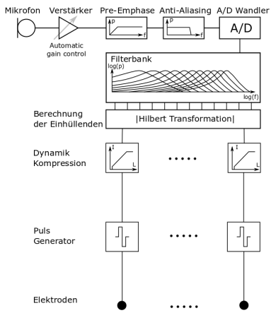

The continuous interleaved sampling strategy consists of the following steps
1. splitting the audio signal into $n$ band-limited signals for log-spaced cutoff frequencies and increasing band-width using band-pass filters
2. extracting the envelopes of the band-pass filtered signals
3. sampling of the envelopes with pulses, where the pulse amplitudes matches the envelopes
4. using bi-phasis, charge-neutral pulse and propagating them to the electrode array, where each electrode channel belongs to one band-pass filter channel.

### Advanced Combination Encoder (ACE)

Only select a subset of the available electrodes in each stimulation cycle.

- using CIS the performance of speech understanding strongly decreases in the presence of even moderate background noise
- ACE does not use an underlying speech model for the signal processing (no estimation of F0 and the formants F1, F2)
- basically the same signal processing structure as CIS
- major difference: selection of only a subset of the available electrodes for each stimulation cycle
- _n of m_
- typically 8 out of the 22 electrodes are selected
- ACE can enhance certain spectral features, channels with relatively low signals are suppressed
- higher speech understanding score than CIS

### Fine-structure Processing (FSP)

### HiRes120

### MP3000

## 35. What does interleaved sampling mean?

The electrodes are driven sequentially such that not more than one electrode creates a current pulse per time. This is due to the fact, that cochlear implant usually have only a single current source and if multiple electrodes were activated at the same time, the potential field would overlap. This may lead to exceedance of the most comfortable level (MCL) of the cochlear.

## 36. What does bio-compatibility mean?

Quality regarding the response of an organism to its presence. A living organism will always encounter a foreign object --> better to talk of _biotolerability_.

## 37. What has to be considered for an implant, which remains in the body for a very long time.

- __durability__: an implanted device must be extremely durable and robust as any maintenance or exchange of the implant requires costly and dangerous surgery.
- __security__: there should be no poisonous materials in the implant that could be released in case of an accident. Additionally there should be no batteries or other consumable materials that need to be frequently replaced.
- __no subcoutaneous connector__: there should be no direct connection though the skin but rather a wire-less interface. E.g. an inductive link
- __hermetic housing__: make sure that nothing get into or outside of the housing
- __simple but flexible electronics__: the implanted electronics should only provide the most basic functions, such that the main behaviour of the system can be determined externally.
- __biocompatible material__: the housing must be made of a biocompatible (or rather biotolerated) material that does not act as a cell poison and is resistant to the defense strategies of the organism.

## 38. Explain the electrode-electrolyte interface

The objective at the electrode-electrolyte interface is to tranfmance an eletron-current into ion flux and vice-versa. Due to various effects the interface has resistive properties as well as capacitive properties. The so-called helmholtz layer from a plate-capacitor-like layer around the electrode. Due to potential differences there evolves a double-layer of water molecules and ions. Addionally, there is the regular Faraday resitivity of the electrode and the electrolyte resitance.

## 39. How can you prevent undesired chemical reactions on the electrode surface?

Using bipolar current pulses. Only using short bipolar pulse results in an overall signal without DC component. Each positive pulse is followed by a negative pulse with the same charge transfer and vice versa. This way, chemical reactions are always reversed after half the total stimulation time.

## 40. Explain the functions of the human speech organ

The human speech organ can be modelled in terms of a system-theory based approach. The vocal chords provide an oscillation with a rather constant frequency (F0). The coniguration of the throat and lips modulates and filters the ground oscillating and creates so-called formants in the output signal.

## 41. Which types of retinal implants do you know?

- subretinal, under the nerves, where the actual rods and cones are also.
- epiretinal, on top of the nerves.